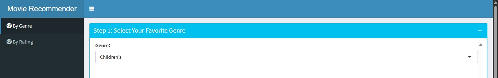
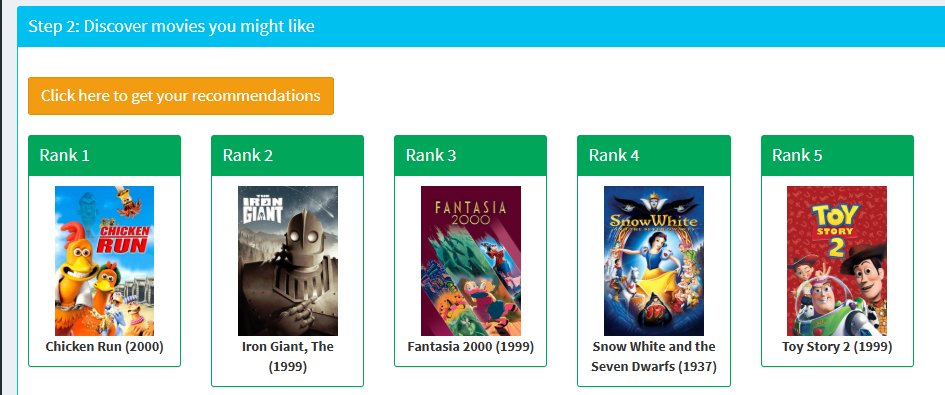
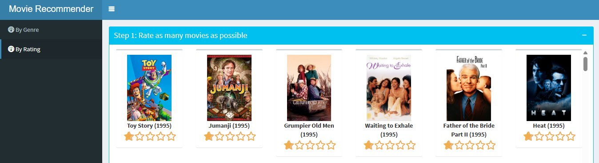
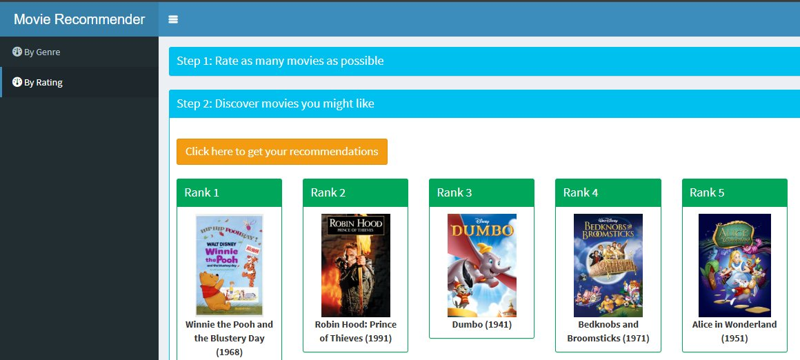

# PSL Project 4 — Movie Recommendation System

**Term:** Fall 2022  
**Author:** Mohammad Hassanpour (`mohassan99`)

---

## Overview

Built a personalized movie recommendation engine using the **MovieLens 1M dataset** (~1 million ratings from 6,040 users across 3,706 movies). The system implements two independent recommendation approaches:

1. **Genre-Based Recommendations** — Two cold-start schemes: *Highly Rated* (Bayesian-adjusted average rating) and *Trending* (recency-weighted popularity surge)
2. **Collaborative Filtering** — User-Based (UBCF) and Item-Based (IBCF) using cosine similarity with the `recommenderlab` package; predictions verified to match reference output within < 1e-6

---

## Live Demo

**[Shiny App → mohassan.shinyapps.io/movierec/](https://mohassan.shinyapps.io/movierec/)**

The app supports both recommendation paths:

| Genre-Based Input | Genre-Based Output |
|---|---|
|  |  |

| Rating-Based Input | Rating-Based Output |
|---|---|
|  |  |

---

## Rendered Notebook

**[View full analysis →](https://mohassan99.github.io/PSL-Project-4-Movie-Recommender/proj4MovieRecommender_MH.html)**

---

## Repository Structure

```
├── proj4MovieRecommender.Rmd         # Base project notebook
├── proj4MovieRecommender_MH.Rmd     # Mohammad's extended analysis
├── proj4MovieRecommender_MH.html    # Rendered HTML notebook
├── movieRec/
│   ├── ReadMe.txt                   # Shiny app instructions
│   ├── app.R                        # Main Shiny application
│   └── functions/
│       └── helpers.R                # Similarity & recommendation helpers
├── assets/
│   ├── screenshot_genre_input.png
│   ├── screenshot_genre_output.png
│   ├── screenshot_rating_input.png
│   └── screenshot_rating_output.png
└── README.md
```

---

## Methods

### Genre-Based (Cold Start)
- **Highly Rated:** Bayesian shrinkage toward global mean (minimum vote threshold) to avoid small-sample inflation
- **Trending:** Exponential recency weighting on rating timestamps to surface recently popular films

### Collaborative Filtering
- **UBCF:** Cosine similarity across the user-item rating matrix; top-N neighbors used to predict unseen ratings
- **IBCF:** Item-item cosine similarity on normalized ratings; model-based approach for scalable inference
- Validation: predictions matched reference implementation output with difference < 1e-6

---

## Tech Stack

`R` · `recommenderlab` · `reshape2` · `dplyr` · `ggplot2` · `Shiny` · `shinyapps.io`
